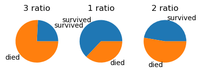
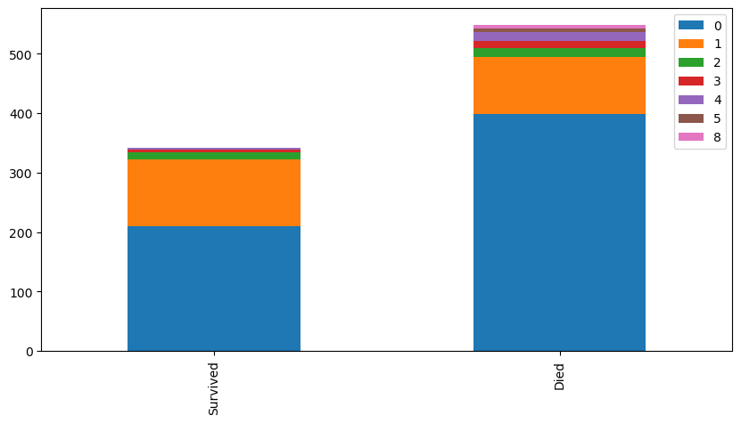
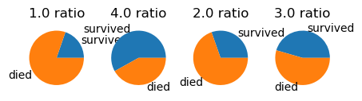

데이터 분석을 통한 타이타닉 생존자 예측
======================


주의할 점
---------------------------
*  이 문서에는 캐글의 주피터 노트북으로 작성되었기 때문에 실제 데이터 처리에 필요한 파일이 존재하지 않습니다


캐글에 타이타닉 데이터 분석 경진대회가 있다.

데이터 분석과 머신러닝의 튜토리얼이라고 불릴 정도로 인기있으며,

제공되는 승객들의 데이터를 이용하여 생존여부를 예측할수 있는 모델을 만드는것이 목표이다.

캐글에서 직접 주피터 노트북을 통해 모델을 만들수 있으며

이 문서 역시 주피터 노트북을 가져와 만들었다


---
캐글에서 처음 코딩을 시도하면 아래와 같은 코드가 주어진다

문제를 해결하기 위해 할일은 다음과 같다

1. 데이터 불러오기
>데이터 불러오기는 간단하게 캐글에서 주어진 데이터를 불러오는 것이다.
2. 특성 선별
>특성 선별은 그래프를 이용해 어떤 특성을 이용해야 정확도가 높은 모델을 학습시킬지 정한다.
3. 전처리 및 파이프라이닝
> 전처리와 파이프라이닝은 선별한 특성들을 포함한 데이터를 학습에 용이하게 변경하고 이를 합치는 것이다.
4. 모델 학습및 결과 제출
> 마지막으로 전처리와 가공을 거친 데이터를 학습시키고 결과를 캐글에 제출한다.


캐글에서 타이타닉 생존자 예측은 https://www.kaggle.com/c/titanic 에서 실시 할수 있다

해당 주소에 접속하면 다음과 같은 화면이 나온다.


이 화면에서 우측의 Join Competition을 눌러 계정을 만들거나 로그인해 시작할 수 있다.

시작하면 기본적으로 필요한 데이터들은 주어진다

그리고 다음과 같은 코드가 기본으로 주어진다


----

```python
# This Python 3 environment comes with many 
#helpful analytics libraries installed
# It is defined by the kaggle/python Docker image: https://github.com/kaggle/docker-python
# For example, here's several helpful packages to load

import numpy as np # linear algebra
import pandas as pd # data processing, CSV file I/O (e.g. pd.read_csv)

# Input data files are available in the read-only "../input/" directory
# For example, running this (by clicking run or pressing Shift+Enter) will list all files under the input directory

import os
for dirname, _, filenames in os.walk('/kaggle/input'):
    for filename in filenames:
        print(os.path.join(dirname, filename))

# You can write up to 20GB to the current directory (/kaggle/working/) that gets preserved as output when you create a version using "Save & Run All" 
# You can also write temporary files to /kaggle/temp/, but they won't be saved outside of the current session
```

    /kaggle/input/titanic/train.csv
    /kaggle/input/titanic/test.csv
    /kaggle/input/titanic/gender_submission.csv


# 1.데이터 불러오기


주어진 데이터를 불러와 변수할당을 해준 후 확인해준다


```python
train = pd.read_csv('/kaggle/input/titanic/train.csv')
test = pd.read_csv('/kaggle/input/titanic/test.csv')

#head를 통해 제대로 불러와졌는지 확인한다
train.head()
```


<div>
<style scoped>
    .dataframe tbody tr th:only-of-type {
        vertical-align: middle;
    }

    .dataframe tbody tr th {
        vertical-align: top;
    }

    .dataframe thead th {
        text-align: right;
    }
</style>
<table border="1" class="dataframe">
  <thead>
    <tr style="text-align: right;">
      <th></th>
      <th>PassengerId</th>
      <th>Survived</th>
      <th>Pclass</th>
      <th>Name</th>
      <th>Sex</th>
      <th>Age</th>
      <th>SibSp</th>
      <th>Parch</th>
      <th>Ticket</th>
      <th>Fare</th>
      <th>Cabin</th>
      <th>Embarked</th>
    </tr>
  </thead>
  <tbody>
    <tr>
      <th>0</th>
      <td>1</td>
      <td>0</td>
      <td>3</td>
      <td>Braund, Mr. Owen Harris</td>
      <td>male</td>
      <td>22.0</td>
      <td>1</td>
      <td>0</td>
      <td>A/5 21171</td>
      <td>7.2500</td>
      <td>NaN</td>
      <td>S</td>
    </tr>
    <tr>
      <th>1</th>
      <td>2</td>
      <td>1</td>
      <td>1</td>
      <td>Cumings, Mrs. John Bradley (Florence Briggs Th...</td>
      <td>female</td>
      <td>38.0</td>
      <td>1</td>
      <td>0</td>
      <td>PC 17599</td>
      <td>71.2833</td>
      <td>C85</td>
      <td>C</td>
    </tr>
    <tr>
      <th>2</th>
      <td>3</td>
      <td>1</td>
      <td>3</td>
      <td>Heikkinen, Miss. Laina</td>
      <td>female</td>
      <td>26.0</td>
      <td>0</td>
      <td>0</td>
      <td>STON/O2. 3101282</td>
      <td>7.9250</td>
      <td>NaN</td>
      <td>S</td>
    </tr>
    <tr>
      <th>3</th>
      <td>4</td>
      <td>1</td>
      <td>1</td>
      <td>Futrelle, Mrs. Jacques Heath (Lily May Peel)</td>
      <td>female</td>
      <td>35.0</td>
      <td>1</td>
      <td>0</td>
      <td>113803</td>
      <td>53.1000</td>
      <td>C123</td>
      <td>S</td>
    </tr>
    <tr>
      <th>4</th>
      <td>5</td>
      <td>0</td>
      <td>3</td>
      <td>Allen, Mr. William Henry</td>
      <td>male</td>
      <td>35.0</td>
      <td>0</td>
      <td>0</td>
      <td>373450</td>
      <td>8.0500</td>
      <td>NaN</td>
      <td>S</td>
    </tr>
  </tbody>
</table>
</div>


-------------------------------------------------------------------------------------
-------------------------------------------------------------------------------------
# 2.특성 선별
현재 주어진 train.csv에서 모든 특성을 이용할것은 아니고 

생존율과 관련이 있을법한 특성을 사용하는게 좋으므로

몇몇 특성만 선별하여 전처리한 후에 그 특성들로 훈련한다

먼저 어떤 특성을 사용할것인지 각각의 특성과 생존율의 관계를 확인한다

텍스트로 보여주기 보다는 직관적인 그림이나 도표를 이용하는것이 편하다

이때 **metaplotlib**의 **seaborn**을 이용할수 있다


```python
import seaborn as sns
import matplotlib.pyplot as plt
```


원반의 형태인 **pie chart**(파이 차트)를 통해 표현할건데

많은 특성의 생존확율을 알아야 하기 때문에 함수로 만들면 편할것이다


```python
def chart(f):
    f_counts=train[f].value_counts(sort=False) 
    #f_counts는 value_counts()를 통해 얻어진 각 값의 빈도수이다
    f_size=f_counts.size #각 값의 종류가 몇가지인지 알려준다
    f_index=f_counts.index # 값의 범위에 대해 알려준다
    survived=train[train['Survived']==1][f].value_counts() 
    #만약 생존한 경우 train의 Survived 특성은 1이다. 따라서 Survived에서 1인 특성의 갯수를 확인하면
    #해당 특성의 생존자 수를 알수 있다
    dead=train[train['Survived']==0][f].value_counts()
    #반대로 사망자는 Survived특성이 0인 경우이다.
    

    plt.pie(f_counts,labels=f_index, autopct='%1.1f%%')
    #f_counts로 각 값의 비율을 나타내고, labels는 값의 이름을 나타내며 
    #autopct=%1.1f%%로 백분율을 소수 한잘 까지 나타내게 해준다
    plt.title(f+' ratio') #그래프의 이름을 표시해준다
    plt.show()#그래프 출력
    #여기까지는 특성 전체의 비율이 얼마나 되는지 보여준다
    
    for i, index in enumerate(f_index):  
        #반복문을 통해 값들을 종류를 enumerate로 반복한다
        #값들을 각각 받아와서 특성이 해당  값일때 의 생존비율을 확인하는 것이다
        plt.subplot(1,f_size+1,i+1, aspect='equal')
        #원래 그래프보다 크기가 작은 보조 그래프인 서브 플롯을 생성한다 
        plt.pie([survived[index],dead[index]],labels=['survived','died'])
        #파이 차트를 통해 표현하는데 해당 값에서의 생존 비율을 나타낸다
        plt.title(str(index)+' ratio')
        #해당 값의 이름을 띄워준다
```

이제 함수를 만들었으니 특성들을 살펴보고 어떤 특성이 적합한지 찾을 수 있다

값에 따라 생존자 격차가 심할수록 그 특성이 적합하다고 볼 수 있다


먼저 성별을 살펴본다


```python
chart('Sex')
```


    

    


    

    


성별은 남성과 여성의 차이가 뚜렷히 나타난다

* 남성의 전체 비율이 약간 높음에도 불구하고 생존 비율은 여성이 훨씬 더 높다

사용하기 적절한 특성이라고 볼 수 있다


```python
chart('Pclass')
```


    

    


    

    


다음으로 살펴본 계층 역시 값 별로 꽤 많은 차이가 난다

계층의 경우 1이 상위 계층, 2가 중간 계층, 3이 하위 계층이다

* 하위 계층의 비율이 높음에도 불구하고 사망자 비율이 가장 높으며

* 상위 계층은 두번째로 비율이 높은데도 사망자 비율이 가장 낮으며

* 중간 계층은 가장 수는 적지만 사망 비율은 2번째였다

계층 등급에 따라 격차가 심하므로 이 특성도 사용할만 한 특성이다

나이는 같은 경우에는 값이 너무 다양하기 떄문에 바로 이 함수로는 사용하기 어려우며

이름으로 생존율을 구하기는 어렵기 때문에 무시한다


```python
chart('Embarked')
```


    

    


    

    


승선한 지역에 따라서 확인하는것도 가능 하다

S는 사우스햄튼 C는 셰르부르 Q는 퀸즈타운이다

셰르부르의 경우 유독 생존자가 높다


나머지 특성 역시 이 함수를 통해 확인하기에는 값의 종류가 다양하다

따라서 이번에는 파이차트가 아닌 **Bar Chart** (바 차트)를 이용해본다

파이차트와 마찬가지로 바 차트 역시 함수로 정의하면 편하다


```python
def chart2(f):
    survived=train[train['Survived']==1][f].value_counts()
    died=train[train['Survived']==0][f].value_counts()
    #해당 특성에 따른 생존과 사망자 수를 먼저 지정해준다
    df=pd.DataFrame([survived, died])
    #그리고 판다스 데이터 프레임으로 사망자, 생존자를 저장한다음
    df.index=['Survived','Died']
    #인덱스를 바꿔준다
    df.plot(kind='bar',stacked=True,figsize=(10,5))
    #그리고 plot을 통해 그래프를 만드는데
    #kind를 통해 바로 설정하고 stacked로 쌓인 형태가 되게 하며 figsize로 크기를정해준다    
    
```

바차트를 정의 했으니 이번에는 아까 확인하기 어려웠던 다른 특성들도 확인해본다


```python
chart2('SibSp')
```


    

    


SibSp는 형제나 배우자와 함께 탄 경우인데 혼자 탄 경우 더 많이 죽었으며

***2명이상 같이 탄 경우***에는 생존율이 올라간다


```python
chart2('Parch')
```


    

    


역시 자식이나 부모가 ***없는 경우*** 사망자의 비율이 올라간다

앞서 확인 한 결과를 정리하면

* 여성인 경우 남성보다 생존 확률이 높았다
* 높은 계층이 하위 계층보다 생존 확률이 높았다
* 셰르부르에 탑승한 승객이 생존 확률이 높았다
* 혼자 탄 경우 2명이상의 동승객과 탄 경우보다 사망 확률이 높았다

정도로 요약이 가능하다

-------------------------------------------------------------------------------------

다만 이정도의 특성만 사용하기에는 정확도가 높게 나올것 같지가 않다

따라서 다른 특성들을 사용하거나 어느정도 수정해서 더 정확한 값이 나오도록 유도해야한다


아직 나이에 대해서는 사용하지 않았는데 나이도 적절하게 처리하면 이용할수 있을것이다

일단 노약자의 경우 다른 연령대의 사람에 비해 생존확율이 높을수도 있다

따라서 각각의 나이를 아동-청년/중년-노년으로 분류 한 후에 다시 **파이 차트**로 확인해볼수 있다


일단 각 나이에 맞게 조건을 지정해준다

1910년대 영국 평균 수명이 52세이기 떄문에 노년의 기준을 50세로 잡아준다

그리고 loc를 이용해 조건에 맞는 값들을 각각 1, 2, 3으로 바꿔준다


```python
import copy
train_bak = pd.read_csv('/kaggle/input/titanic/train.csv')
train=copy.deepcopy(train_bak)

train.loc[train['Age']<=15,'Age']=1
train.loc[(train['Age']>15) &(train['Age']<=50),'Age']=2
train.loc[train['Age']>50,'Age']=3
```


```python
train
```


<div>
<style scoped>
    .dataframe tbody tr th:only-of-type {
        vertical-align: middle;
    }

    .dataframe tbody tr th {
        vertical-align: top;
    }

    .dataframe thead th {
        text-align: right;
    }
</style>
<table border="1" class="dataframe">
  <thead>
    <tr style="text-align: right;">
      <th></th>
      <th>PassengerId</th>
      <th>Survived</th>
      <th>Pclass</th>
      <th>Name</th>
      <th>Sex</th>
      <th>Age</th>
      <th>SibSp</th>
      <th>Parch</th>
      <th>Ticket</th>
      <th>Fare</th>
      <th>Cabin</th>
      <th>Embarked</th>
    </tr>
  </thead>
  <tbody>
    <tr>
      <th>0</th>
      <td>1</td>
      <td>0</td>
      <td>3</td>
      <td>Braund, Mr. Owen Harris</td>
      <td>male</td>
      <td>2.0</td>
      <td>1</td>
      <td>0</td>
      <td>A/5 21171</td>
      <td>7.2500</td>
      <td>NaN</td>
      <td>S</td>
    </tr>
    <tr>
      <th>1</th>
      <td>2</td>
      <td>1</td>
      <td>1</td>
      <td>Cumings, Mrs. John Bradley (Florence Briggs Th...</td>
      <td>female</td>
      <td>2.0</td>
      <td>1</td>
      <td>0</td>
      <td>PC 17599</td>
      <td>71.2833</td>
      <td>C85</td>
      <td>C</td>
    </tr>
    <tr>
      <th>2</th>
      <td>3</td>
      <td>1</td>
      <td>3</td>
      <td>Heikkinen, Miss. Laina</td>
      <td>female</td>
      <td>2.0</td>
      <td>0</td>
      <td>0</td>
      <td>STON/O2. 3101282</td>
      <td>7.9250</td>
      <td>NaN</td>
      <td>S</td>
    </tr>
    <tr>
      <th>3</th>
      <td>4</td>
      <td>1</td>
      <td>1</td>
      <td>Futrelle, Mrs. Jacques Heath (Lily May Peel)</td>
      <td>female</td>
      <td>2.0</td>
      <td>1</td>
      <td>0</td>
      <td>113803</td>
      <td>53.1000</td>
      <td>C123</td>
      <td>S</td>
    </tr>
    <tr>
      <th>4</th>
      <td>5</td>
      <td>0</td>
      <td>3</td>
      <td>Allen, Mr. William Henry</td>
      <td>male</td>
      <td>2.0</td>
      <td>0</td>
      <td>0</td>
      <td>373450</td>
      <td>8.0500</td>
      <td>NaN</td>
      <td>S</td>
    </tr>
    <tr>
      <th>...</th>
      <td>...</td>
      <td>...</td>
      <td>...</td>
      <td>...</td>
      <td>...</td>
      <td>...</td>
      <td>...</td>
      <td>...</td>
      <td>...</td>
      <td>...</td>
      <td>...</td>
      <td>...</td>
    </tr>
    <tr>
      <th>886</th>
      <td>887</td>
      <td>0</td>
      <td>2</td>
      <td>Montvila, Rev. Juozas</td>
      <td>male</td>
      <td>2.0</td>
      <td>0</td>
      <td>0</td>
      <td>211536</td>
      <td>13.0000</td>
      <td>NaN</td>
      <td>S</td>
    </tr>
    <tr>
      <th>887</th>
      <td>888</td>
      <td>1</td>
      <td>1</td>
      <td>Graham, Miss. Margaret Edith</td>
      <td>female</td>
      <td>2.0</td>
      <td>0</td>
      <td>0</td>
      <td>112053</td>
      <td>30.0000</td>
      <td>B42</td>
      <td>S</td>
    </tr>
    <tr>
      <th>888</th>
      <td>889</td>
      <td>0</td>
      <td>3</td>
      <td>Johnston, Miss. Catherine Helen "Carrie"</td>
      <td>female</td>
      <td>NaN</td>
      <td>1</td>
      <td>2</td>
      <td>W./C. 6607</td>
      <td>23.4500</td>
      <td>NaN</td>
      <td>S</td>
    </tr>
    <tr>
      <th>889</th>
      <td>890</td>
      <td>1</td>
      <td>1</td>
      <td>Behr, Mr. Karl Howell</td>
      <td>male</td>
      <td>2.0</td>
      <td>0</td>
      <td>0</td>
      <td>111369</td>
      <td>30.0000</td>
      <td>C148</td>
      <td>C</td>
    </tr>
    <tr>
      <th>890</th>
      <td>891</td>
      <td>0</td>
      <td>3</td>
      <td>Dooley, Mr. Patrick</td>
      <td>male</td>
      <td>2.0</td>
      <td>0</td>
      <td>0</td>
      <td>370376</td>
      <td>7.7500</td>
      <td>NaN</td>
      <td>Q</td>
    </tr>
  </tbody>
</table>
<p>891 rows × 12 columns</p>
</div>


1,2,3 으로 처리했으니 미리 만들어둔 파이 차트함수인 chart()를 이용해서 확인해보자


```python
chart('Age')
```


    

    


    

    


확실히 어린이의 경우가 더 생존율이 높았다는것을 확인 할수 있다

좀더 세분화 할수도 있을것 같다

이번에는 더 많이 나누어서 어느정도의 데이터를 사용하면 좋을지 확인해본다


```python
train = copy.deepcopy(train_bak)

train.loc[train['Age']<=10,'Age']=1
train.loc[(train['Age']>10) &(train['Age']<=20),'Age']=2
train.loc[(train['Age']>20) &(train['Age']<=35),'Age']=3
train.loc[(train['Age']>35) &(train['Age']<=50),'Age']=4
train.loc[train['Age']>50,'Age']=5


```


```python
chart('Age')
```


    

    


    

    


다른 연령계층의 경우 큰 차이가 없고 오로지 10살 이하의 아동만 더 높은 생존률을 보였으며

나머지 연령은 큰 차이를 보이지 않으므로

아예 어린아이와 나머지계층으로 나누는것도 나쁘지 않을것 같다


```python
train = copy.deepcopy(train_bak)

train.loc[train['Age']<=10,'Age']=1
train.loc[train['Age']>10,'Age']=2

```


```python
chart('Age')
```


    

    


    

    


아동을 제외한 나머지 계층을 합친다 할지라도 생존비율은 이전과 큰 차이가 없으므로

이렇게 아동과 나머지로 분할하는게 더 확실하게 볼수 있는것 같다

-------------------------------------------------------------------------------------

다음으로 운임도 이런식으로 어느정도 계층을 나누면 좋을것 같다


```python
train['Fare'].value_counts().sort_index()
```


    0.0000      15
    4.0125       1
    5.0000       1
    6.2375       1
    6.4375       1
                ..
    227.5250     4
    247.5208     2
    262.3750     2
    263.0000     4
    512.3292     3
    Name: Fare, Length: 248, dtype: int64


운임은 0~512까지로 지정되었는데

3분위수를 이용하면 좋을것 같다


```python
q1=train['Fare'].quantile(.25)
q2=train['Fare'].quantile(.50)
q3=train['Fare'].quantile(.75)

print("25%:",q1)
print("50%:",q2)
print("75%:",q3)
```

    25%: 7.9104
    50%: 14.4542
    75%: 31.0


이제 나이와 마찬가지로 loc을 이용해 각각 1, 2, 3, 4로 변경해준다


```python

train.loc[train['Fare']<=q1,'Fare']=1
train.loc[(train['Fare']>q1) &(train['Fare']<=q2),'Fare']=2
train.loc[(train['Fare']>q2) &(train['Fare']<=q3),'Fare']=3
train.loc[train['Fare']>q3,'Fare']=4
```


```python
train
```


<div>
<style scoped>
    .dataframe tbody tr th:only-of-type {
        vertical-align: middle;
    }

    .dataframe tbody tr th {
        vertical-align: top;
    }

    .dataframe thead th {
        text-align: right;
    }
</style>
<table border="1" class="dataframe">
  <thead>
    <tr style="text-align: right;">
      <th></th>
      <th>PassengerId</th>
      <th>Survived</th>
      <th>Pclass</th>
      <th>Name</th>
      <th>Sex</th>
      <th>Age</th>
      <th>SibSp</th>
      <th>Parch</th>
      <th>Ticket</th>
      <th>Fare</th>
      <th>Cabin</th>
      <th>Embarked</th>
    </tr>
  </thead>
  <tbody>
    <tr>
      <th>0</th>
      <td>1</td>
      <td>0</td>
      <td>3</td>
      <td>Braund, Mr. Owen Harris</td>
      <td>male</td>
      <td>2.0</td>
      <td>1</td>
      <td>0</td>
      <td>A/5 21171</td>
      <td>1.0</td>
      <td>NaN</td>
      <td>S</td>
    </tr>
    <tr>
      <th>1</th>
      <td>2</td>
      <td>1</td>
      <td>1</td>
      <td>Cumings, Mrs. John Bradley (Florence Briggs Th...</td>
      <td>female</td>
      <td>2.0</td>
      <td>1</td>
      <td>0</td>
      <td>PC 17599</td>
      <td>4.0</td>
      <td>C85</td>
      <td>C</td>
    </tr>
    <tr>
      <th>2</th>
      <td>3</td>
      <td>1</td>
      <td>3</td>
      <td>Heikkinen, Miss. Laina</td>
      <td>female</td>
      <td>2.0</td>
      <td>0</td>
      <td>0</td>
      <td>STON/O2. 3101282</td>
      <td>2.0</td>
      <td>NaN</td>
      <td>S</td>
    </tr>
    <tr>
      <th>3</th>
      <td>4</td>
      <td>1</td>
      <td>1</td>
      <td>Futrelle, Mrs. Jacques Heath (Lily May Peel)</td>
      <td>female</td>
      <td>2.0</td>
      <td>1</td>
      <td>0</td>
      <td>113803</td>
      <td>4.0</td>
      <td>C123</td>
      <td>S</td>
    </tr>
    <tr>
      <th>4</th>
      <td>5</td>
      <td>0</td>
      <td>3</td>
      <td>Allen, Mr. William Henry</td>
      <td>male</td>
      <td>2.0</td>
      <td>0</td>
      <td>0</td>
      <td>373450</td>
      <td>2.0</td>
      <td>NaN</td>
      <td>S</td>
    </tr>
    <tr>
      <th>...</th>
      <td>...</td>
      <td>...</td>
      <td>...</td>
      <td>...</td>
      <td>...</td>
      <td>...</td>
      <td>...</td>
      <td>...</td>
      <td>...</td>
      <td>...</td>
      <td>...</td>
      <td>...</td>
    </tr>
    <tr>
      <th>886</th>
      <td>887</td>
      <td>0</td>
      <td>2</td>
      <td>Montvila, Rev. Juozas</td>
      <td>male</td>
      <td>2.0</td>
      <td>0</td>
      <td>0</td>
      <td>211536</td>
      <td>2.0</td>
      <td>NaN</td>
      <td>S</td>
    </tr>
    <tr>
      <th>887</th>
      <td>888</td>
      <td>1</td>
      <td>1</td>
      <td>Graham, Miss. Margaret Edith</td>
      <td>female</td>
      <td>2.0</td>
      <td>0</td>
      <td>0</td>
      <td>112053</td>
      <td>3.0</td>
      <td>B42</td>
      <td>S</td>
    </tr>
    <tr>
      <th>888</th>
      <td>889</td>
      <td>0</td>
      <td>3</td>
      <td>Johnston, Miss. Catherine Helen "Carrie"</td>
      <td>female</td>
      <td>NaN</td>
      <td>1</td>
      <td>2</td>
      <td>W./C. 6607</td>
      <td>3.0</td>
      <td>NaN</td>
      <td>S</td>
    </tr>
    <tr>
      <th>889</th>
      <td>890</td>
      <td>1</td>
      <td>1</td>
      <td>Behr, Mr. Karl Howell</td>
      <td>male</td>
      <td>2.0</td>
      <td>0</td>
      <td>0</td>
      <td>111369</td>
      <td>3.0</td>
      <td>C148</td>
      <td>C</td>
    </tr>
    <tr>
      <th>890</th>
      <td>891</td>
      <td>0</td>
      <td>3</td>
      <td>Dooley, Mr. Patrick</td>
      <td>male</td>
      <td>2.0</td>
      <td>0</td>
      <td>0</td>
      <td>370376</td>
      <td>1.0</td>
      <td>NaN</td>
      <td>Q</td>
    </tr>
  </tbody>
</table>
<p>891 rows × 12 columns</p>
</div>


이제 chart로 다시 확인해본다


```python
chart('Fare')
```


    

    


    

    


3분위로 정확히 4분할했기 때문에 비율은 일정하다

그런데 이때 생존 비율은 어느정도 차이가 나는것을 볼 수 있다

***운임 비용이 높을 수록*** 생존할 확률이 증가 한것이다

앞서 확인 한 결과와

* 여성인 경우 남성보다 생존 확률이 높았다
* 높은 계층이 하위 계층보다 생존 확률이 높았다
* 셰르부르에 탑승한 승객이 생존 확률이 높았다
* 혼자 탄 경우 2명이상의 동승객과 탄 경우보다 사망 확률이 높았다

추가로 2가지 결과를 더 얻어냈다
* 어린 아이의 생존 확률이 더 높았으며 그 위의 나잇대는 연령에 따른 별다른 차이가 보이지 않는다
* 운임 비용이 높을 수록 생존 확률이 올라갔다


-------------------------------------------------------------------------------------
-------------------------------------------------------------------------------------


# 3. 전처리

이제 어떤 특성을 사용할지 어느정도 찾았으니 이제 전처리를 이용하면 된다


먼저 테스트와 트레인을 한거번에 처리하기 위해 리스트로 합친다


```python
train = pd.read_csv('/kaggle/input/titanic/train.csv')
test = pd.read_csv('/kaggle/input/titanic/test.csv')
train_test=[train, test]
```

사용하고 싶은 특성들은 **성별, 선착장, 나이, 운임, 계층**이다

-------------------------------------------------------------------------------------

먼저 성별을 전처리 해준다
지금은 obj 데이터타입 이므로 str으로 바꿔준다


```python
for dataset in train_test:
    dataset['Sex'] = dataset['Sex'].astype(str)
```

-------------------------------------------------------------------------------------

다음으로는 선착장을 전처리 해준다

선착장을 살펴보면


```python
train['Embarked'].value_counts(dropna=False)
```


    S      644
    C      168
    Q       77
    NaN      2
    Name: Embarked, dtype: int64


결측치가 2개 존재한다

대부분의 사람들은 사우스햄튼에서 탑승했으므로 2명도 그냥 사우스햄튼 탑승으로 해주고

obj를 str로 바꿔준다


```python
for dataset in train_test:
    dataset['Embarked'] = dataset['Embarked'].fillna('S')
    dataset['Embarked'] = dataset['Embarked'].astype(str)
```

-------------------------------------------------------------------------------------

이번에는 나이를 바꿔준다


위에 도표에서 처럼 10살을 기준으로 위아래로 나눠주고

결측치가 꽤 많이 존재하기 때문에 평균으로 넣어야하는데 어차피 10을 기준으로 하면 평균은 10보다 위로 나오기 때문에 그냥 other에 넣어준다


마찬가지로 경향성을 갖지 않게 하기위해 str 형태로 넣어준다


```python
for dataset in train_test:
    dataset['Age'].fillna(1, inplace=True)
```


```python
for dataset in train_test:
    dataset.loc[dataset['Age']<=10,'Age']=0
    dataset.loc[dataset['Age']>10,'Age']=1

    dataset['Age'] = dataset['Age'].map( { 0: 'child',1:'other'})
```

-------------------------------------------------------------------------------------

이번에는 Fare인데 test에 결측치가 하나 존재하니 해결한 후에

아까 처럼 3분위수로 나눠 주기 위해 일단 quantile을 통해 3분위수를 구한다

결측치는 3분위수로 얻는 중앙값으로 하면 될것 같다


```python
test.isnull().sum() #결측치 확인
```


    PassengerId      0
    Pclass           0
    Name             0
    Sex              0
    Age              0
    SibSp            0
    Parch            0
    Ticket           0
    Fare             1
    Cabin          327
    Embarked         0
    dtype: int64


```python
for dataset in train_test:
    q1=dataset['Fare'].quantile(.25)
    q2=dataset['Fare'].quantile(.5)
    q3=dataset['Fare'].quantile(.75)
    dataset['Fare'].fillna(q2, inplace=True)
print(q1, q2, q3)
```

    7.8958 14.4542 31.5


마찬가지로 loc을 이용해 분류한다


```python
for dataset in train_test:
    dataset.loc[dataset['Fare']<q1,'Fare']=1
    dataset.loc[(dataset['Fare']>q1) &(dataset['Fare']<=q2), 'Fare']=2
    dataset.loc[(dataset['Fare']>q2) &(dataset['Fare']<=q3), 'Fare']=3
    dataset.loc[dataset['Fare']>q3,'Fare']=4
```

계층과 Fare는 경향성을 가져도 크게 이상하지 않음으로 전처리 해줄 필요가 없다

-------------------------------------------------------------------------------------

마지막으로 필요없는 특성들을 추출하고 남은 전처리 과정을 거친다


```python
features_drop = ['Name', 'Ticket', 'Cabin', 'SibSp', 'Parch']
train=train.drop(features_drop, axis=1)
test=test.drop(features_drop, axis=1)
train=train.drop(['PassengerId'], axis=1)
```


```python
print(train.head())
print(test.head())
```

       Survived  Pclass     Sex    Age  Fare Embarked
    0         0       3    male  other   1.0        S
    1         1       1  female  other   4.0        C
    2         1       3  female  other   2.0        S
    3         1       1  female  other   4.0        S
    4         0       3    male  other   2.0        S
       PassengerId  Pclass     Sex    Age  Fare Embarked
    0          892       3    male  other   1.0        Q
    1          893       3  female  other   1.0        S
    2          894       2    male  other   2.0        Q
    3          895       3    male  other   2.0        S
    4          896       3  female  other   2.0        S


원하는 것처럼 pclass, sex, age, fare, eambarked만 존재한다

이제 문자열은 원핫 인코딩으로 다시 전처리 하고 train과 label을 분리하면 된다


```python
train = pd.get_dummies(train)
test = pd.get_dummies(test)
#더미로 원핫 인코딩을 해준다
train_label = train['Survived']
train_data = train.drop('Survived', axis=1)
test_data = test.drop("PassengerId", axis=1).copy()
```

# 4.모델 학습 및 결과

결측치와 경향성을 해결했으므로 이제 모델을 학습시키면 된다

예측 모델은 스킷런에서 5가지를 사용할수 있다

1. 로지스틱스
2. SVM
3. K-근접이웃
4. 랜덤 포레스트
5. 나이브 베이즈


```python
from sklearn.linear_model import LogisticRegression
from sklearn.svm import SVC
from sklearn.neighbors import KNeighborsClassifier
from sklearn.ensemble import RandomForestClassifier
from sklearn.naive_bayes import GaussianNB
#각각 해당하는 모델을 불러온다

from sklearn.utils import shuffle #섞어주기
train_data, train_label = shuffle(train_data, train_label, random_state = 5)
```

어떤게 좋은지는 직접 실험해보면 되는데

그냥 실험하면 번거로우니 함수로 만들어준다


```python
def train_and_test(model):
   model.fit(train_data, train_label)
   prediction = model.predict(test_data)
   accuracy = round(model.score(train_data, train_label) * 100, 2)
   print("Accuracy : ", accuracy, "%")
   return prediction
```


```python
# 1. 로지스틱스

log_pred = train_and_test(LogisticRegression())
# 2. SVM
svm_pred = train_and_test(SVC())
# 3. K-근접이웃
knn_pred_4 = train_and_test(KNeighborsClassifier(n_neighbors = 4))
# 4. 랜덤 포레스트
rf_pred = train_and_test(RandomForestClassifier(n_estimators=100))
# 5. 나이브 베이즈
nb_pred = train_and_test(GaussianNB())
```

    Accuracy :  78.0 %
    Accuracy :  79.8 %
    Accuracy :  81.93 %
    Accuracy :  83.39 %
    Accuracy :  77.89 %


랜덤 포레스트의 결과가 가장 높게 나왔으므로 이걸 이용한다

submission 을 이용해 가장 정확도가 높은것을 csv로 추출한다


```python
rf_pred
```


    array([0, 1, 0, 0, 0, 0, 1, 0, 1, 0, 0, 1, 1, 0, 1, 1, 0, 0, 0, 1, 0, 0,
           1, 0, 1, 0, 1, 0, 1, 0, 0, 0, 0, 0, 0, 0, 1, 0, 0, 0, 0, 0, 0, 1,
           1, 0, 0, 0, 1, 0, 0, 0, 1, 1, 0, 0, 0, 0, 0, 1, 0, 0, 0, 1, 0, 1,
           1, 0, 0, 1, 1, 0, 0, 0, 1, 0, 0, 1, 0, 1, 0, 0, 1, 0, 0, 0, 1, 0,
           1, 1, 0, 0, 1, 0, 0, 0, 1, 0, 1, 0, 1, 0, 0, 0, 0, 0, 0, 0, 0, 0,
           0, 1, 1, 1, 1, 0, 0, 0, 0, 1, 1, 0, 1, 0, 0, 0, 0, 1, 0, 0, 0, 0,
           0, 0, 0, 0, 0, 0, 0, 0, 0, 1, 0, 0, 1, 0, 0, 0, 0, 0, 1, 0, 0, 0,
           0, 0, 1, 1, 1, 0, 1, 0, 1, 0, 0, 0, 0, 0, 1, 0, 0, 0, 0, 0, 0, 1,
           1, 0, 1, 1, 0, 0, 1, 0, 1, 0, 1, 0, 0, 0, 0, 0, 0, 0, 1, 0, 0, 1,
           0, 1, 1, 0, 0, 1, 0, 0, 1, 0, 1, 0, 0, 0, 0, 1, 1, 0, 1, 0, 1, 0,
           1, 0, 1, 0, 1, 1, 0, 1, 0, 0, 0, 1, 0, 0, 0, 0, 0, 0, 1, 1, 1, 1,
           0, 0, 0, 0, 1, 0, 1, 0, 1, 0, 0, 0, 0, 0, 0, 0, 1, 0, 0, 0, 1, 1,
           0, 0, 0, 0, 1, 0, 0, 0, 1, 1, 0, 1, 0, 0, 0, 0, 0, 0, 1, 1, 0, 0,
           0, 0, 0, 0, 0, 1, 0, 0, 0, 0, 1, 0, 0, 0, 0, 0, 0, 0, 1, 1, 0, 0,
           0, 0, 0, 0, 0, 1, 1, 1, 0, 0, 0, 0, 0, 0, 0, 1, 1, 0, 1, 0, 0, 0,
           1, 0, 0, 1, 0, 1, 0, 0, 0, 0, 0, 0, 0, 1, 0, 1, 0, 1, 0, 1, 1, 0,
           0, 0, 0, 1, 1, 0, 0, 0, 0, 1, 1, 0, 1, 0, 0, 0, 1, 0, 0, 1, 0, 0,
           1, 1, 0, 0, 0, 0, 0, 0, 0, 0, 1, 1, 0, 0, 0, 0, 0, 1, 0, 0, 0, 1,
           0, 1, 0, 0, 1, 0, 1, 0, 0, 0, 0, 0, 1, 1, 1, 1, 1, 0, 1, 0, 0, 0])


```python
pd.DataFrame({"PassengerId": test["PassengerId"],"Survived": rf_pred}).to_csv('submission_rf.csv', index=False)
```
